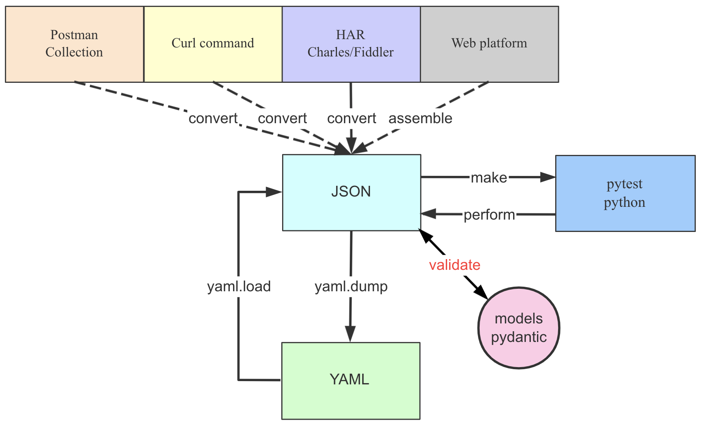
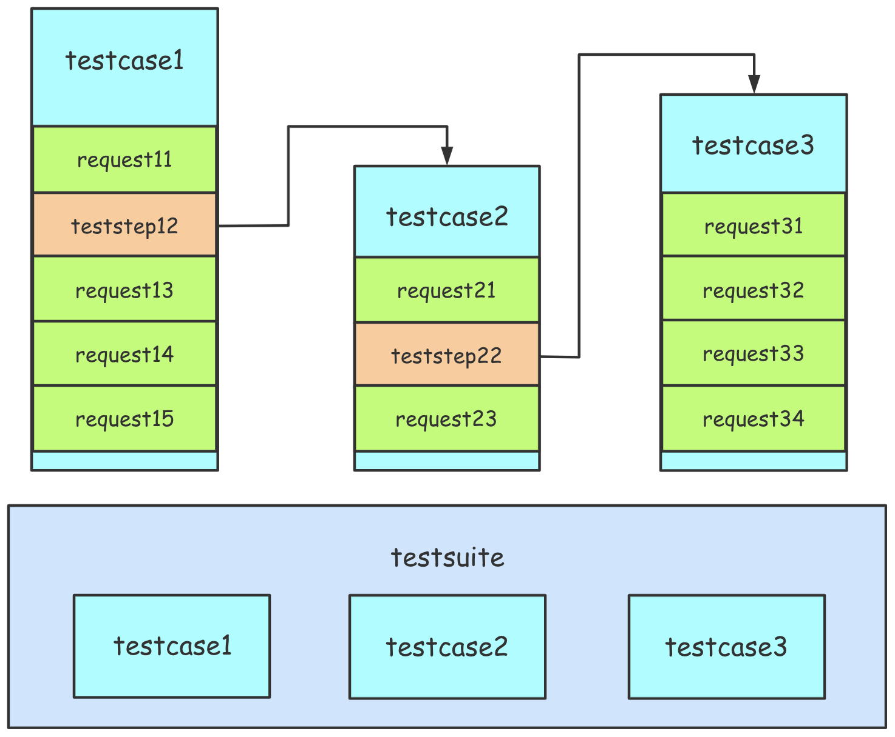
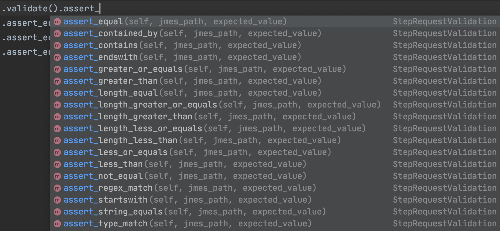

#HTTPRunner学习 
## httprunner设计原理：  
1. 惯例优先原则：Convention over configuration
1. ROI事项：ROI matters
1. 拥抱开源，requests, pytest, pydantic, allure locust：Embrace open source, leverage requests, pytest, pydantic, allure and locust.
## 关键词：
1. 继承强大的requests的特征，使用了handle http(s)的主要方法
1. 使用YAML/JSON的方式组织testcase, 使用pytest优雅的运行方式
1. 使用har记录和生成testcases
1. 使用variablies/extract/validate/hooks支持复杂的测试场景
1. 使用debugtalk.py插件，支持在testcase中使函数
1. jmespath，使得extract和validate json 应答更方便
1. pytest有数百个插件可被使用
1. allure，测试报告可以非常漂亮和强大
1. 通过locust, 可以使得性能测试无需额外增加工作
1. 支持CLI 命令，可以实现ci/cd无法对接
## Httprunner安装
httprunner 支持python 3.6+ 和windows/Linux/macOS等多种系统。
### 1. httprunner 可以通过pip进行安装：
   $ pip install httprunner
   $ pip install git+https://github.com/httprunner/httprunner.git@master
   检查是否安装完毕：
       当httprunner安装完毕，系统中将被安装4个命令：
       httprunner: 主要的命令，可以使用所有的函数
       hrun: httprunner run的别名，用于运行yaml/json/pytest测试用例
       hmake: httprunner make的别名，用于转换yaml/json为pytest的测试用例
       har2case: httprunner har2case的别名，用于转换har为yaml/json测试用例
   查看httprunner版本：
       httprunner -V #hrun -V
   查看运行选项：
       $ httprunner -h   
### 2. 快速创建项目：
     $ httprunner startproject -h #查看使用说明
     example:
<!--快速创建项目-->
        $ httprunner startproject demo
<!--显示创建的文件-->
        $ tree demo -a  
<!--运行测试用例-->
        $ hrun demo

### 3. 录制http请求数据，生成测试用例
    使用Charles Proxy，fiddler或者浏览器的开发者工具捕获http请求数据。保存为**.har文件，然后通过har2case转换为测试用例。
    从v3.0.7以后开始，默认产生pytest类型的测试用例
    $ har2case har/postman-echo-form.har #产生postman-echo-form_test.py
    $ har2case har/postman-echo-form.har -2j/--to-json #产生postman-echo-form.json测试用例
    $ har2case har/postman-echo-form.har -2y/--to-yml #产生postman-echo-form.yml测试用例
    
### 4. 测试用例
    httprunner v3.X 支持.yml/.json/pytest三种测试用例，这里主要介绍pytest形式的测试用例其他的两种形式可以参考最后的链接官方文档。  

    
#### 测试用例组织    
       每个HttpRunner测试用例是HttpRunner的子类，并且必须包含config和teststeps两个属性。
       

##### a) config: 配置testcase级别的config, 包含base_url, verify, variables, export
       

##### b) teststeps: teststep列表（List[step]）,每个step相当于一个api请求或者testcase应用调用。此外还支持variables/extract/validate/hooks机制实现更为复杂的场景。

    from httprunner import HttpRunner, Config, Step, RunRequest, RunTestCase
    class TestCaseRequestWithFunctions(HttpRunner):
        config = (
            Config("request methods testcase with functions")
            .variables(
                **{
                    "foo1": "config_bar1",
                    "foo2": "config_bar2",
                    "expect_foo1": "config_bar1",
                    "expect_foo2": "config_bar2",
                }
            )
            .base_url("https://postman-echo.com")
            .verify(False)
            .export(*["foo3"])
        )
    
        teststeps = [
            Step(
                RunRequest("get with params")
                .with_variables(
                    **{"foo1": "bar11", "foo2": "bar21", "sum_v": "${sum_two(1, 2)}"}
                )
                .get("/get")
                .with_params(**{"foo1": "$foo1", "foo2": "$foo2", "sum_v": "$sum_v"})
                .with_headers(**{"User-Agent": "HttpRunner/${get_httprunner_version()}"})
                .extract()
                .with_jmespath("body.args.foo2", "foo3")
                .validate()
                .assert_equal("status_code", 200)
                .assert_equal("body.args.foo1", "bar11")
                .assert_equal("body.args.sum_v", "3")
                .assert_equal("body.args.foo2", "bar21")
            ),
            Step(
                RunRequest("post form data")
                .with_variables(**{"foo2": "bar23"})
                .post("/post")
                .with_headers(
                    **{
                        "User-Agent": "HttpRunner/${get_httprunner_version()}",
                        "Content-Type": "application/x-www-form-urlencoded",
                    }
                )
                .with_data("foo1=$foo1&foo2=$foo2&foo3=$foo3")
                .validate()
                .assert_equal("status_code", 200)
                .assert_equal("body.form.foo1", "$expect_foo1")
                .assert_equal("body.form.foo2", "bar23")
                .assert_equal("body.form.foo3", "bar21")
            ),
        ]
    
    
    if __name__ == "__main__":
        TestCaseRequestWithFunctions().test_start()

###### Config: 每个testcase应该有一个config部门，可以是testcase级别的配置。
    a) name(必须的): testcase的一部分，会显示在测试报告和运行日志中。
    b) base_url(可选择的): 功能路径，url的一部分。比如：https://postman-echo.com。如果设置了base_url的话，在teststep中的url中只能设置相对路径。如果需要切换不同的环境的话，该功能很有用。
    c) variables(可选择的)：testcase通用变量。每个step中可以引用没有在step中设置的变量。换句话说，step中设置的变量的级别比在config中设置的变量级别更高。
    d)verify(可选择的)：指定是否验证服务器的TLS证书。如果想要记录testcase中的http数据特别有用。如果不设置或者设置为true则会产生SSLError错误。
    e)export(可选择的)：提取testcase的session变量。测试用例是为黑盒，config中的的variables视为输入，export为输出。特别是，当该testcase中的某个输出作为下一个testcase中的输入的时候特别有用。
######  teststeps：每一个testcase中包括一个或者多个排序的steps列表（List[Step]）。每一个step相当于一个api的request或者另一个testcase的引用。如下图：

    
    a) RunRequest(name)： RunRequest在一个步骤中用于向API发出请求，并为响应执行一些提取或验证。RunRequest的参数name作为step的名字，将会在测试报告和运行日志中显示。  
-        .with_variables: teststep的变量。 每个步骤中的变量都是相互独立的，因此如果想相互共享variable的话，需要把variable配置在config中。另外teststep中的变量会覆盖config中相同名称的变量。
-        .method(url): 指定http的方法和SUt的url，它对应于requests.request的方法和url参数。如果配置中设置了base_url，则此处之能设置相对路径。
-        .with_params 指定request url的参数，这个相当于requests.request中的params参数的数据。
-        .with_headers 指定request的http headers。相当于requests.request的headers参数部分。
-        .with_cookies 指定request的http cookies。相当于requests.request的cookies参数部分。
-        .with_data 指定request的http body。相当于requests.request的data参数部分。
-        .with_json 指定request的http json。相当于requests.request的json参数部分。
-        .extract 使用jmespath提取json 应答数据： .with_jmespath(jmes_path:Text, var_name:Text)-->jmes_path: jmespath表达式，可以参考[https://jmespath.org/tutorial.html](https://jmespath.org/tutorial.html "JMESPath Tutorial")做详细了解；var_name： 存储提取值的变量名，该变量可以被后续的steps中直接使用。
-        .validate 使用jmespath提取json应答数据，并使用.assert_xxx（jmes_path:Text, expected_value:Any）验证期望值。其中jmes_path表示jmespath表达式； expected_value为预期值，变量或者函数表示。如下图：
    b) RunTestCase(name): 在step中引用RunTestCase来调用另一个testcase。参数name为用来表示testcase的名字，会展示在运行日志中和测试报告中。
-   .with_variables 同 RunRequest的.with_variables
-   .call 指定引用testcase的类
-   .export 指定要从引用的testcase导出的会话变量名。导出的变量可以被后续的测试步骤引用。    

    <code>
        import os  
        import sys
        
        sys.path.insert(0, os.getcwd())
        
        from httprunner import HttpRunner, Config, Step, RunRequest, RunTestCase
        
        from examples.postman_echo.request_methods.request_with_functions_test import (
            TestCaseRequestWithFunctions as RequestWithFunctions,
        )
        
        
        class TestCaseRequestWithTestcaseReference(HttpRunner):
            config = (
                Config("request methods testcase: reference testcase")
                .variables(
                    **{
                        "foo1": "testsuite_config_bar1",
                        "expect_foo1": "testsuite_config_bar1",
                        "expect_foo2": "config_bar2",
                    }
                )
                .base_url("https://postman-echo.com")
                .verify(False)
            )
        
            teststeps = [
                Step(
                    RunTestCase("request with functions")
                    .with_variables(
                        **{"foo1": "testcase_ref_bar1", "expect_foo1": "testcase_ref_bar1"}
                    )
                    .call(RequestWithFunctions)
                    .export(*["foo3"])
                ),
                Step(
                    RunRequest("post form data")
                    .with_variables(**{"foo1": "bar1"})
                    .post("/post")
                    .with_headers(
                        **{
                            "User-Agent": "HttpRunner/${get_httprunner_version()}",
                            "Content-Type": "application/x-www-form-urlencoded",
                        }
                    )
                    .with_data("foo1=$foo1&foo2=$foo3")
                    .validate()
                    .assert_equal("status_code", 200)
                    .assert_equal("body.form.foo1", "bar1")
                    .assert_equal("body.form.foo2", "bar21")
                ),
            ]
        
        if __name__ == "__main__":
            TestCaseRequestWithTestcaseReference().test_start()
</code>

  

### 5. 运行Testcase  
>  testcase准备好以后可以使用命令行（CLI）来执行测试用例：  
    hrun = httprunner run   
    有多种运行方式：  
    $ hrun path/to/testcase1
    $ hrun path/to/testcase1 path/to/testcase2
    $ hrun path/to/testcase_folder/  
    也可以直接运行yml/json类型的testcases: 如果你的testcase是yaml/json格式的，hrun在运行的过程中会先把yaml/json格式的testcase转换为pytest file格式的testcase，然后再运行pytest名命令。
    $ hrun = make + pytest  
    在yaml/json转换为pytest file的过程中会在./yml/.yaml/.json文件同一个文件夹下产生同名_test.py文件。：/path/to/example.yml => /path/to/example_test.py  

>  注意: 默认情况下hrun运行不会打印详细的request和response信息。如果想要有request&response的详细信息同步打印出来,同时产生详细日志(<ProjectRootDir>/logs/TestCaseID.run.log)，可以在cli中添加-s （--capture=no） 如：$ hrun -s examples/postman_echo/request_methods/request_with_functions.yml  
>  为方便故障排查，每一个测试用例经产生一个唯一的uuid4 ID号，并且每个请求头将自动添加带有testcase ID的HRUN-Request-ID字段。    

### 6. 测试报告
> 受益于pytest框架的兼容，httprunner 3.x 支持pytest的测试插件，如：pytest-html 和 allure-pytest。  
> 使用html report： 安装pytest-html插件（pip install pytest-html），可以添加--html 命令行参数生成pytest-html格式的测试报告。可以参考[https://pypi.org/project/pytest-html/](https://pypi.org/project/pytest-html/ "pytest-html")查看详细介绍。    
   $ hrun /path/to/testcase --html=report.html

>  使用allure report:  安装allure-pytest插件（pip install allure-pytest/ pip install "httprunner[allure]"）, 可以在hrun/pytest命令中使用如下参数：    
- --alluredir=DIR： 指定的目录下生成测试报告  
- --clean-alluredir: 清理alluredir文件夹（如果存在）  
- --allure-no-capture: 不附加pytest捕获的logging/stdout/stderr报告。 
>  想生成完整的allure 测试报告需要如下两个命令：  
    $ hrun /path/to/testcase --alluredir=/tmp/my_allure_result  
    $ allure serve /tmp/my_allure_results  (这个命令需要安装allure)  
    详细查看[https://docs.qameta.io/allure/#_pytest](https://docs.qameta.io/allure/#_pytest "allure-pytest")介绍。也可参考[https://www.cnblogs.com/hao2018/p/11321959.html](https://www.cnblogs.com/hao2018/p/11321959.html "pytes+allure的")博客详情。
    

### 7. httprunner的参数化
>参数化为一个测试工具必备的技能之一，没有参数化的就无法实现脚本的扩展性。  
>httprunner 3.1.4+以后实现了三种模式的参数化形式:     
> `    @pytest.mark.parametrize(  
        "param",  
        Parameters(  
            {  
                "user_agent": ["iOS/10.1", "iOS/10.2"],  
                "username-password": "${parameterize(request_methods/account.csv)}",  
                "app_version": "${get_app_version()}",  
            }  
        ),  
    )  
    def test_start(self, param):  
        super().test_start(param)  
`
上述代码中三种模式的参数化形式  
> 1，"user_agent": ["iOS/10.1", "iOS/10.2"]; 这种模式直接把参数化数据写在参数后面的list中   
> 2,"username-password": "${parameterize(request_methods/account.csv)}", 这种形式的参数化数据写在了account.csv中，csv中的内容如下：  
    phoneNumber,verifyCode,storeCode  
	18856012041,123456,STORE000086

>3,"app_version": "${get_app_version()}",这种模式是把参数化内容写到了debugtalk.py文件中的函数内了。  
    def get_app_version():  
    return ['1.0.2', '1.0.3']    

> 注意：Parameters这个固件属于V3.1.4中的新技能，所以如果使用这个固件的话需要把httprunner升级到3.1.4版本。  

### 8. httprunner中的文件上传  
> 文件上传属于每个系统都必须必备的功能之一，因此框架支持文件上传也就理所当然的成为了必然。httprunner文件上传借鉴了requests_toolbelt和filetype连个第三方库，因此如果使用httprunner实现文件上传功能需要安装这两个库：  
> `pip install requests_toolbelt filetype   `  
> 当然也可以通过httprunner集成的库来安装：   
> `pip install "httprunner[upload]"`  
> 文件长传实例：    
>      
`        Step(  
            RunRequest("upload file")  
            .with_variables(   
                **{  
                    "file_path": "test.env",  
                    "m_encoder": "${multipart_encoder(file=$file_path)}",  
                }  
            )  
            .post("/post")  
            .with_headers(**{"Content-Type": "${multipart_content_type($m_encoder)}"})  
            .with_data("$m_encoder")  
            .validate()  
            .assert_equal("status_code", 200)  
            .assert_startswith("body.files.file", "UserName=test")  
        ),`

----------
# httprunner实战笔记 #

##1,通过fiddler捕获http接口信息   
-  打开fiddler设置好http代理。chrome浏览器自动代码，无需再行设置，其他的浏览器需要最相应设置。  
-  在浏览器中进行按照模块进行操作，比如登录操作。分模块操作并把结果保存下来这样方便模块重复使用。  
-  对fiddler中的session进行过滤，比如相应是js脚本的，相应是css文件的等过滤掉，然后把过滤后的session通过：File->Export Session-> All Session保存为login.har文件,保存的文件名尽量有对应的含义，方便后续使用的时候容易识别。    
##2，通过httprunner har2case 把.har文件转换为.yml文件    

-  如果没有httprunner项目环境，可以通过httprunner startproject demo命令来建立新的项目  
-  把.har文件拷贝到/demo/har文件夹下面  
-  通过httprunner make /demo/har/.har命令把.har文件转换为对应文件名的.yml文件  

## 3，对.yml文件做参数化处理   
-  把url中的公共部分提到config中的base_url中，方便以后整体替换 
-  把需要参数话的数据通过在debugtalk.py中做函数话处理或者是在config中的variables中设置，作为用例的扩展  
-  把request.headers.Host删除掉，为了用例可以在不同的环境中使用（测试环境/开发环境）  
-  url 做简化处理，把每一个step中的url路径处理成相对于base_url的部分  
-  关联性字段提取，通过extract字段。比如token的提取：`        extract:
            token: "body.data.token"`  
## 4, 把.yml文件转换成pytest脚本  
-  通过httprunner make ./.yml 命令把.yml文件转换成*——test.py的pytest脚本  
-  在转换的过程共可以把多个待转换的.yml文件组成一个testcase的.yml文件进行一次行转换，这个方便用例管理  
-  注：本步骤是选做步骤，httprunner支持直接运行.yml用例

## 5，测试用例的运行  
>运行pytest脚本  
-  httprunner run path/to/testcase  
-  httprunner run path/to/testcase1 /path/to/testcase2  
-  httprunner run path/to/testcase_folder/  
-  pytest path/to/testcase  
-  pytest path/to/testcase_folder/  

>直接运行yaml/json用例
-  httprunner run /path/to/example.yml  

## 6, 生成测试用例   
> 因为httprunner继承了pytest，所以httprunner支持pytest支持的两种测试报告模式pytest-html/allure-pytest。我是用的是allure-pytest报告模式，安装allure-pytest（pip install allure-pytest,  安装allure[https://www.jianshu.com/p/9e5cd946696d](https://www.jianshu.com/p/9e5cd946696d "allure")
-  hrun /path/to/testcase --alluredir=/tmp/my_allure_results  
-  allure serve /tmp/my_allure_results

## 7，问题  
> 在运行的过程中有可能会出现警告异常，这个和测试结果没关系。  

## 8， 官方文档地址  
> 详细内容可以参考[ httprunner V3 doc](https://docs.httprunner.org/user/testing_report/)  
> 有些概念性的知识在V3的文档中没有详细介绍，可以参考v
> [ httprunner V2 doc](https://v2.httprunner.org/prepare/testcase-structure/)